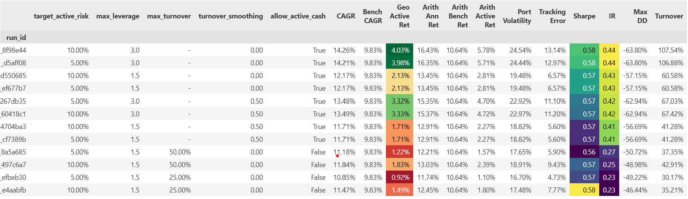
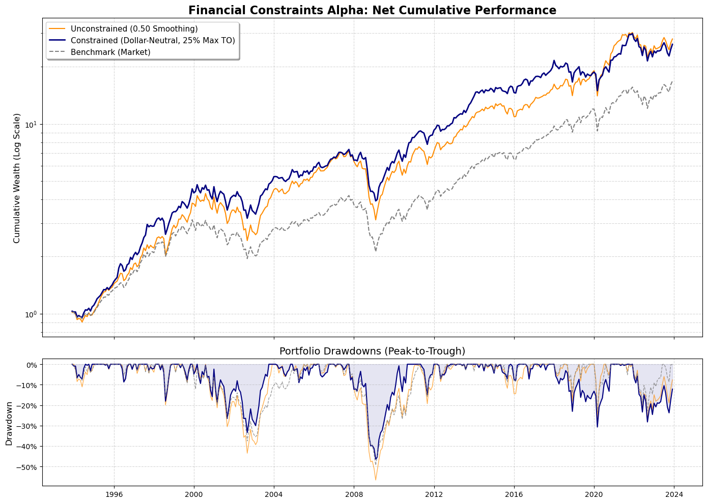

#  Systematic Asset Pricing & Portfolio Optimization Engine

[](https://www.python.org/downloads/)
[](https://opensource.org/licenses/MIT)
[](https://www.cvxpy.org/)

An end-to-end, institutional-grade quantitative research pipeline and backtesting engine. Built on the theoretical foundations of **Active Portfolio Management** (Grinold & Kahn), this engine transforms raw, point-in-time financial data into optimized, cost-aware equity portfolios.

## The Alpha Edge: Financial Constraints
While vanilla momentum and value factors are heavily crowded, this engine leverages custom alpha signals derived from PhD research into **corporate financial constraints** (building on the Whited-Wu index). 
* **The Premium:** Isolates a "Quality" premium by systematically shorting distressed firms.
* **The Edge:** Possesses significant multi-month memory, allowing for highly profitable extraction even under strict institutional turnover budgets and transaction cost friction.

## System Architecture
The codebase is fully decoupled into a modular Python library (`src/`), designed for compute efficiency and scale.

1. **`merger.py` (Data Ingestion):** Aligns raw CRSP daily market data with Compustat quarterly fundamentals, enforcing strict point-in-time lagging to eliminate lookahead bias. Data is handled exclusively via `.parquet` for high-speed memory mapping.
2. **`engine.py` (Factor Construction):** Computes cross-sectional academic risk factors and the proprietary constraint premium via Fama-MacBeth regressions and robust z-scoring.
3. **`risk.py` (Risk Modeling):** Implements a Fundamental Factor Model ($V = XFX^T + \Delta$). Utilizes an EWMA (Half-Life = 36 months) to predict the forward-looking Asset Covariance Matrix, capturing volatility clustering.
4. **`alpha.py` (Alpha Engine):** Employs **Gram-Schmidt Orthogonalization** over a 60-month rolling window to strip out market beta, ensuring the signal represents pure residual return ($h_B^T \alpha \approx 0$).
5. **`portfolio.py` (Dual-Solver Optimization):**
   * **Fast Linalg Solver:** Solves the unconstrained Mean-Variance problem ($h_{PA}^* \propto V^{-1} \alpha$) to map the theoretical efficient frontier.
   * **CVXPY Quadratic Programmer:** Enforces strict institutional mandates, including pure dollar-neutrality, absolute maximum turnover ceilings (e.g., 25% monthly churn), and 1.5x gross leverage caps.
6. **`backtest.py` (Simulation & Friction):** Replays history, accounting for passive weight drift between rebalances. Applies a flat **10 bps transaction cost** to generate a true net-of-fee institutional tearsheet.

## Performance & Results

The engine executes a multidimensional parameter sweep to map the strategy's transition from an idealized academic model to a fully constrained, cost-aware institutional portfolio.

### The Institutional Tearsheet (Net of Fees)
*This matrix highlights the trade-off between alpha extraction and transaction friction.*

<p align="center">
  <!-- REPLACE THE LINK BELOW WITH YOUR ACTUAL MATRIX SCREENSHOT -->
  
</p>

### The "Drawdown Armor" (CVXPY Constraint Protection)
By enforcing strict dollar-neutrality and turnover caps, the `CVXPY` optimization engine sacrifices some theoretical upside to provide massive structural protection during market crashes (e.g., the 2008 GFC). 

* **Unconstrained Model Drawdown:** -56.69%
* **Constrained CVXPY Drawdown:** -46.44%

<p align="center">
  <!-- REPLACE THE LINK BELOW WITH YOUR ACTUAL MATPLOTLIB CHART SCREENSHOT -->
  
</p>

## Quick Start

**1. Clone the repository and install dependencies:**
```bash
git clone [https://github.com/naderih/Systematic-Asset-Pricing-Engine.git](https://github.com/naderih/Systematic-Asset-Pricing-Engine.git)
cd Systematic-Asset-Pricing-Engine
pip install -r requirements.txt
```

**2. Configure Data Paths:**
Ensure your CRSP/Compustat `.dta` files are located in your local environment, and map the paths in `main.ipynb` (Cell 1).

**3. Run the Orchestration Engine:**
Open `main.ipynb` and execute the cells sequentially. The master sweep utilizes a **smart-caching layer** to avoid redundant CVXPY calculations, making iterative research highly efficient.

##  Tech Stack
* **Core Data:** `pandas`, `numpy`, `pyarrow` (Parquet)
* **Optimization:** `cvxpy`, `scipy`
* **Modeling & Stats:** `statsmodels`, `scikit-learn`
* **Visualization:** `matplotlib`, `seaborn`

---
*Disclaimer: This repository is for academic and quantitative research purposes only. It does not constitute financial advice.*